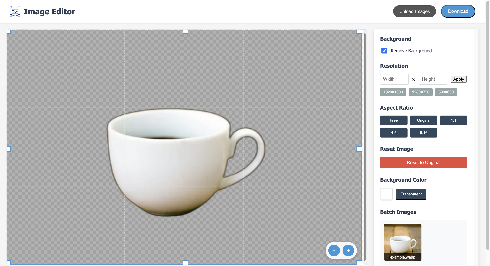

# Image Editor Web App

A web-based image editor that allows users to remove backgrounds from images and make basic edits. Built with Flask and Python.

## Features

- Background removal from images
- Dimension and Aspect Ratio adjustments
- Multiple images upload and download functionality
- Simple and intuitive user interface
- Real-time image processing

## Try it out!

You can try the application directly at:
[https://shannenlolol.pythonanywhere.com/]

## How it works:

### Main Interface


### Background Removal


### Change Background


### Change Resolution and Aspect Ratio


### Upload multiple images and browse through/remove them


## Local Installation (Optional)

If you want to run this application locally:

1. Clone the repository:
```bash
git clone https://github.com/yourusername/ImageEditorWebApp.git
cd ImageEditorWebApp
```

2. Create a virtual environment (recommended):
```bash
python -m venv venv
source venv/bin/activate  # On Windows, use: venv\Scripts\activate
```

3. Install the required packages:
```bash
pip install -r requirements.txt
```

4. Start the Flask application:
```bash
python app.py
```

5. Open your web browser and navigate to:
```
http://localhost:5000
```

## Technologies Used

- Python
- Flask
- rembg (for background removal)
- PIL (Python Imaging Library)
- HTML/CSS/JavaScript


## License

This project is licensed under the MIT License - see the LICENSE file for details.
